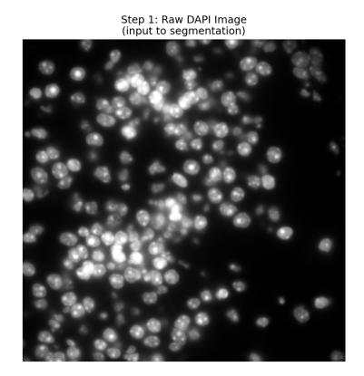
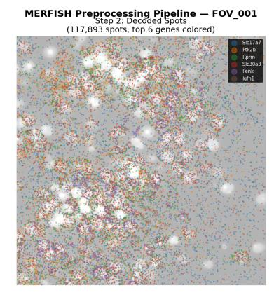
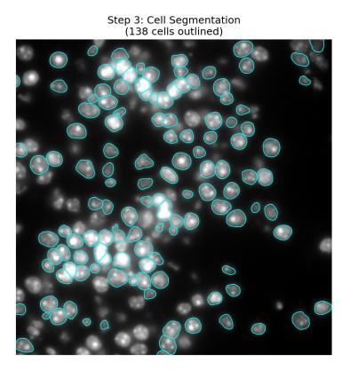
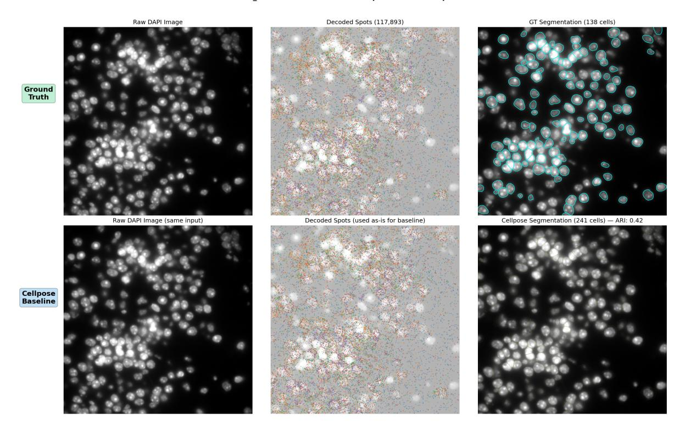
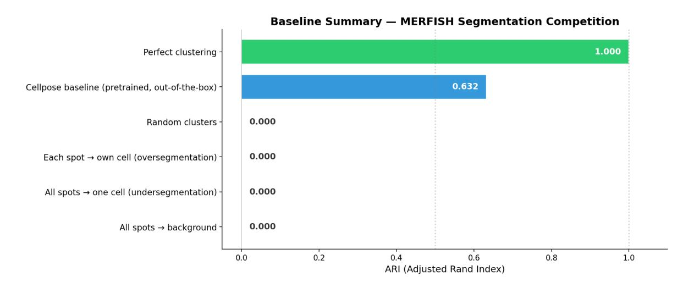

# CS-GY 9223 / CS-UY 3943 - Neuroinformatics, Spring 2026 Project 3 Phase 1: Cell Type Classification

## **Important Links & Deadline**

**Kaggle Competition:** [Join Competition \(Kaggle Link\)](https://www.kaggle.com/t/a2d4558c641c4493978de0138fbed19a) **Team Sign-Up Sheet:** [Sign Up Here \(Google Sheets\)](https://docs.google.com/spreadsheets/d/1Tu6QcL9wOg7mvzkuRHxkbUi75WSoXxEcbon9jzhQl9k/edit?usp=sharing)

**Deadline: April 24, 2026 at 11:55 PM EST (Friday midnight)**

**Code Submission:** Upload zipped code to **Brightspace**

#### **Phase 1 of 2**

This is **Phase 1** of a two-phase project.

- **Phase 1** focused on Cell segmentation and extracellular spots.
- **Phase 2** focuses on **predicting xyz coordinates**.
- Representations and insights learned in Phase 1 may carry over to Phase 2.

**Note:** You are allowed to use pre-built libraries (PyTorch, TensorFlow, scikit-learn, etc.) to implement your solution. You are free to use any pretrained models or additional datasets as well.

#### **Submission Instructions:**

- Submit a **final zipped code file** as your project submission on Brightspace.
- Use **Markdown cells** in notebook or neatly comment your code to include explanations wherever needed.
- You are allowed to use **LLMs**. If you do:
  - **–** Include the **chat history** you had with the LLM along with your submission.
  - **–** This helps us understand your **thinking style**.
- Participate in the **Kaggle competition** and submit your submission.csv file there.

• **Participation in Kaggle is mandatory, and your** *private leaderboard* **ranking will be used for final Project 3 Phase 2 scoring.**

#### **Competition At A Glance:**

| Item          | Details                                                                         |
|---------------|---------------------------------------------------------------------------------|
| Training Data | 40 FOVs of raw MERFISH imaging (∼1,200 genes) with ground truth cell boundaries |
| Test Data     | 4 FOVs (raw images + decoded spots, cell assignments withheld)                  |
| Evaluation    | ∼224K spots across 4 test FOVs<br>Adjusted Rand Index (ARI) on                  |
| Baseline      | = 0.63)<br>Pretrained Cellpose (ARI                                             |

#### **Quick Start:**

- 1. Sign up your team on the Team Sign-Up Sheet
- 2. Join the Kaggle competition and download/access the dataset from HPC
- 3. Explore the 40 training FOVs (raw images, decoded spots, cell boundaries, expression matrix)
- 4. Build a cell segmentation pipeline and assign each spot to a cell
- 5. Generate predictions for all ∼224K spots across 4 test FOVs
- 6. Submit your submission.csv to Kaggle
- 7. Submit your code/notebook to Brightspace before the deadline

## **Contents**

| 1 | Problem Statement                           | 4  |
|---|---------------------------------------------|----|
|   | 1.1<br>Background<br>                       | 4  |
|   | 1.2<br>Challenge Goal<br>                   | 4  |
|   | 1.3<br>What You Will Learn<br>              | 4  |
| 2 | Data Description                            | 4  |
|   | 2.1<br>Dataset Overview<br>                 | 4  |
|   | 2.2<br>Imaging Setup<br>                    | 5  |
|   | 2.3<br>Target Variable<br>                  | 5  |
|   | 2.4<br>Segmentation Approaches<br>          | 5  |
|   | 2.5<br>Extracellular Spots<br>              | 6  |
|   | 2.6<br>Tissue Heterogeneity<br>             | 6  |
|   | 2.7<br>The Task<br>                         | 6  |
|   | 2.8<br>File Structure<br>                   | 7  |
|   | 2.9<br>fov<br>metadata.csv<br>              | 7  |
|   | 2.10 test<br>spots.csv<br>                  | 7  |
|   | 2.11 Raw Image Files (.dax)<br>             | 7  |
|   | 2.12 Training Ground Truth<br>              | 8  |
| 3 | Evaluation Metrics                          | 8  |
|   | 3.1<br>Adjusted Rand Index (ARI)<br>        | 8  |
|   | 3.2<br>Final Scoring<br>                    | 9  |
|   |                                             |    |
|   | 3.3<br>Public/Private Leaderboard Split<br> | 9  |
|   | 3.4<br>Reference Scores<br>                 | 9  |
| 4 | Baseline Results                            | 10 |
|   | 4.1<br>Key Takeaways<br>                    | 12 |
| 5 | Submission Instructions                     | 12 |
|   | 5.1<br>Required Output<br>                  | 12 |
|   | 5.2<br>Important Requirements<br>           | 12 |
|   | 5.3<br>Creating a Submission<br>            | 13 |
|   | 5.4<br>Loading Data<br>                     | 13 |
|   | 5.5<br>Report Submission Deadline<br>       | 14 |
| 6 | Glossary                                    | 14 |

## <span id="page-3-0"></span>**1 Problem Statement**

### <span id="page-3-1"></span>**1.1 Background**

Spatial transcriptomics maps gene expression at single-cell resolution across intact tissue, revealing how cells are organized and how they communicate within their native spatial context. **MERFISH** (Multiplexed Error-Robust Fluorescence In Situ Hybridization) achieves this by encoding each gene as a unique binary barcode read across multiple rounds of fluorescence imaging. After decoding, researchers are left with millions of mRNA dots scattered in 3D space – but to analyze gene expression per cell, they must first determine **which dots belong to which cell**. This is the **cell segmentation and assignment** problem, and it is the critical bottleneck of every spatial transcriptomics pipeline: downstream analyses such as cell typing, spatial domain discovery, and cell-cell communication all depend on getting this step right.

### <span id="page-3-2"></span>**1.2 Challenge Goal**

**Can we segment cells from raw microscope images and correctly assign every mRNA molecule to the cell it belongs to?**

**Task:** Given raw MERFISH imaging data (DAPI and polyT fluorescence channels) from mouse brain tissue along with a list of ∼224K decoded mRNA spots, **segment the cells and assign each spot to a cell** (or label it as extracellular background). Your clustering will be compared to the hidden ground truth across 4 held-out test fields of view using the **Adjusted Rand Index (ARI)** – a cluster similarity metric that is independent of cluster naming.

#### <span id="page-3-3"></span>**1.3 What You Will Learn**

- How spatial transcriptomics data is generated (MERFISH imaging, barcode decoding)
- Techniques for cell segmentation from microscope images (Cellpose, U-Net, StarDist, SAM, 3D segmentation)
- How to train and fine-tune supervised segmentation models on domain-specific data
- How to evaluate clustering quality using cluster-similarity metrics (Adjusted Rand Index)

## <span id="page-3-4"></span>**2 Data Description**

#### <span id="page-3-5"></span>**2.1 Dataset Overview**

The dataset consists of raw MERFISH imaging data from a sagittal section of mouse brain tissue (experiment 220912 wb3 sa2 2 5z18R merfish5, Zhuang lab, Brain Image Library). Each field of view (FOV) captures a ∼220 × 220 µm region of tissue at 2048 × 2048 pixel resolution across 5 z-planes, imaging ∼1,200 genes through 15 rounds of fluorescence microscopy.

Table 1: Dataset Summary

| Split | FOVs | Image Size        | Z-Planes | Cells  | Decoded Spots |
|-------|------|-------------------|----------|--------|---------------|
| Train | 40   | ×<br>2048<br>2048 | 5        | ∼4,082 | ∼2.6M         |
| Test  | 4    | 2048<br>×<br>2048 | 5        | ∼449   | ∼224K         |

#### <span id="page-4-0"></span>**2.2 Imaging Setup**

- **Raw .dax files:** 18 files per FOV 1 multichannel Epi file (27 frames: DAPI, polyT, fiducial, + 2 gene channels across 5 z-planes), 15 gene imaging round files, and 2 fiducial-only files. All uint16, 2048 × 2048 pixels per frame.
- **DAPI (405 nm):** fluorescent dye that binds DNA in the nucleus. Used as the primary input for cell segmentation.
- **polyT (488 nm):** synthetic probe that binds mRNA poly-A tails, highlighting the cytoplasm. Used together with DAPI to define cell body extent.
- **Decoded spots:** 15 rounds × 2 channels = 30 barcode bits (plus 2 from the Epi file) per FOV have already been decoded into mRNA spots. Each spot is a (x, y, z, gene) tuple. Shape: ∼224K spots total across 4 test FOVs.
- Pixel size: 0.109 µm per pixel; z-plane spacing: 1.5 µm

#### <span id="page-4-1"></span>**2.3 Target Variable**

Table 2: Submission Target: Spot-to-Cell Assignment

| Column        | Description                                                                                   | Example                        |
|---------------|-----------------------------------------------------------------------------------------------|--------------------------------|
| cluster<br>id | The cell each spot belongs to – any string ID<br>Use<br>background<br>for extracellular spots | my<br>cell<br>42<br>background |

**Note:** Cluster IDs are arbitrary strings. The evaluation metric (Adjusted Rand Index) is cluster-ID independent – it only checks whether pairs of spots are grouped consistently with the ground truth, regardless of what you call them. You do not need to predict gene identities, cell types, or cell boundaries – only which spots belong together.

## <span id="page-4-2"></span>**2.4 Segmentation Approaches**

There are several natural strategies for cell segmentation and spot assignment:

- 1. **Pretrained segmentation model:** Run an off-the-shelf model like Cellpose, StarDist, or Segment Anything (SAM) on the DAPI/polyT images, then assign each decoded spot to the cell whose mask contains it (point-in-polygon test). This is the baseline approach.
- 2. **Fine-tuned segmentation:** Train or fine-tune a custom segmentation model (Cellpose, U-Net, StarDist) on the 40 training FOVs using the provided ground truth cell boundaries as labels. Domain adaptation on this tissue type should outperform the pretrained baseline.

- 3. **3D segmentation:** Cells span multiple z-planes. Using 3D segmentation (jointly across all 5 z-planes) instead of 2D per-plane segmentation may improve boundary quality.
- 4. **Spot-aware segmentation:** Use the provided decoded spots as an additional signal – regions with high spot density are more likely to be cells. This can help where DAPI/polyT signal is weak.

#### <span id="page-5-0"></span>**2.5 Extracellular Spots**

A substantial fraction of mRNA spots lie in the **extracellular space** – they are real molecules but do not belong to any cell. These must be labeled as background in your submission. Marking extracellular spots as cells (or vice versa) hurts your score. You can identify extracellular spots in the training data by checking which spots fall inside any ground truth cell boundary and labeling the rest as background:

```
import pandas as pd
from matplotlib.path import Path
cells = pd.read˙csv("train/ground˙truth/cell˙boundaries˙train.csv", index˙col
   =0) spots = pd.read˙csv("train/ground˙truth/spots˙train.csv")
# For each spot, check which cell boundary polygon contains it.
```

Your segmentation pipeline must handle this: naively assigning every spot to some cell will lower your score.

## <span id="page-5-1"></span>**2.6 Tissue Heterogeneity**

All 40 training FOVs are drawn from a diverse region of mouse brain and cover multiple tissue types, including cortex, cerebellum, and adjacent regions. The 4 test FOVs are from the same brain but are held out for evaluation. Cell density, cell size, and cell shape vary significantly across FOVs – a segmentation model tuned to one tissue type may fail on another, so robustness across tissue types is important.

#### <span id="page-5-2"></span>**2.7 The Task**

For each of the 4 test FOVs, you are given raw DAPI/polyT images and a list of decoded mRNA spots (position + gene identity), but **no cell boundaries or assignments are provided**. Your goal is to segment the cells from the raw images and cluster each decoded spot into the cell it belongs to (or background) across all ∼224K test spots. You have 40 training FOVs with full ground truth (raw images, decoded spots, cell boundaries, expression matrix) to build and validate your pipeline.

### <span id="page-6-0"></span>**2.8 File Structure**

See Kaggle Competition page

#### <span id="page-6-1"></span>**2.9 fov metadata.csv**

Table 3: FOV Metadata Columns

| Column        | Description                                                                                       |
|---------------|---------------------------------------------------------------------------------------------------|
| fov           | FOV<br>prefix (FOV<br>001, ,<br>FOV<br>A,<br>FOV<br>B,<br>FOV<br>C,<br>FOV<br>D)<br>FOV name with |
| fov<br>x      | µm (global frame)<br>X-origin of the FOV in                                                       |
| fov<br>y      | Y-origin of the FOV in<br>µm (global frame)                                                       |
| pixel<br>size | µm per pixel (0.109 for all FOVs)                                                                 |

#### <span id="page-6-2"></span>**2.10 test spots.csv**

Table 4: Test Spots (Given to Students)

| Column         | Description                                                         |
|----------------|---------------------------------------------------------------------|
| spot<br>id     | Unique string identifying this spot (e.g.,<br>spot<br>0)            |
| fov            | Which test FOV (FOV<br>A,<br>FOV<br>B,<br>FOV<br>C, or<br>FOV<br>D) |
| global<br>x    | µm (global frame)<br>Spot x-coordinate in                           |
| global<br>y    | µm (global frame)<br>Spot y-coordinate in                           |
| global<br>z    | Z-plane index (0–4)                                                 |
| target<br>gene | Decoded gene name (e.g.,<br>Slc17a7)                                |

#### <span id="page-6-3"></span>**2.11 Raw Image Files (.dax)**

Each FOV folder contains 18 raw .dax files – uint16, 2048 × 2048 pixels per frame:

Table 5: .dax File Types per FOV

| File                             | Frames | Contents                                                   |
|----------------------------------|--------|------------------------------------------------------------|
| {fov}.dax<br>Epi408s5            | 27     | ×<br>DAPI, polyT, fiducial + 2 gene channels<br>5 z-planes |
| {fov}<br>{round}.dax<br>Epi545s1 | 17     | ×<br>2 gene channels<br>5 z-planes (rounds 00–14)          |
| {fov}<br>{0,1}.dax<br>Epi545s1   | 7      | Fiducial-only files for image registration                 |

#### Loading a raw image:

```
import numpy as np
# Multichannel Epi file: 27 frames total
# DAPI (405 nm): frames [6, 11, 16, 21, 26] - z0 to z4
# polyT (488 nm): frames [5, 10, 15, 20, 25] - z0 to z4
raw = np.fromfile("train/FOV˙001/Epi-750s5-635s5-545s1-473s5-408s5˙001.dax",
dtype=np.uint16).reshape(-1, 2048, 2048)
dapi˙z2 = raw[16] # DAPI at middle z-plane
polyt˙z2 = raw[15] # polyT at middle z-plane
```

#### <span id="page-7-0"></span>**2.12 Training Ground Truth**

**Training FOVs** (train/FOV XXX/):

- \*.dax 18 raw image files per FOV (same format as test FOVs).
- train/ground truth/spots train.csv Decoded spots with columns [barcode id, global x, global y, global z, x, y, fov, target gene]. ∼2.6M spots across 40 training FOVs.
- train/ground truth/cell boundaries train.csv Cell segmentation polygons. Index = cell ID; columns = boundaryX z0. . .boundaryX z4 and boundaryY z0. . .boundaryY z4 (comma-separated polygon coordinates in µm, one set per z-plane). These serve as **training labels for supervised segmentation models**.
- train/ground truth/counts train.h5ad Cell-by-gene expression matrix in AnnData format. Shape: (4082 cells, 1147 genes). Obs metadata: fov, center x, center y, volume.

**Test FOVs** (test/FOV X/):

- \*.dax 18 raw image files per FOV (same format as training).
- **No cell boundaries or assignments are provided.** This is what you predict.
- Test spot positions and gene identities are given in the root-level test spots.csv.

## <span id="page-7-1"></span>**3 Evaluation Metrics**

Submissions are evaluated by comparing your predicted spot-to-cell assignments to the hidden ground truth across **4 test FOVs** (∼224,500 total spots).

#### <span id="page-7-2"></span>**3.1 Adjusted Rand Index (ARI)**

The Adjusted Rand Index measures how similar your clustering is to the ground truth clustering. It counts the fraction of **pairs of spots** that are grouped consistently between the two clusterings, corrected for chance. Crucially, ARI is **cluster-ID independent** – you can name your cells anything, and the metric only cares whether spots that belong together in the ground truth are also grouped together in your prediction.

For each pair of spots (i, j), the two clusterings agree if either:

- Both spots are in the **same** cluster in both prediction and ground truth, or
- Both spots are in **different** clusters in both prediction and ground truth.

For FOV f:

$$ARI(f) = \frac{RI(f) - E[RI]}{\max(RI) - E[RI]}$$
 (1)

where RI is the raw Rand Index (fraction of pairs that agree) and E[RI] is the expected Rand Index under random labeling (the chance correction).

#### <span id="page-8-0"></span>**3.2 Final Scoring**

The final leaderboard score is the average ARI across all 4 test FOVs:

Final Score = 
$$\frac{1}{4} \sum_{f=1}^{4} ARI(f)$$
 (2)

This ensures all FOVs contribute equally, regardless of the number of spots or cells they contain.

**Range:** [−1, 1] where 1 indicates perfect clustering (higher is better). On the Kaggle leaderboard, a **higher ARI** corresponds to a **higher rank**.

Table 6: ARI Interpretation

| ARI      | Meaning                                                           |
|----------|-------------------------------------------------------------------|
| = 1.0    | Perfect clustering – spots grouped exactly as in the ground truth |
| ><br>0.0 | Clustering is better than random                                  |
| = 0.0    | Equivalent to random clustering (trivial baseline)                |
| <<br>0.0 | Worse than random                                                 |

#### <span id="page-8-1"></span>**3.3 Public/Private Leaderboard Split**

Table 7: Leaderboard Configuration

| Leaderboard | Test FOVs | Spots    |  |
|-------------|-----------|----------|--|
|             |           |          |  |
| Public      | 2 FOVs    | ∼115,000 |  |
| Private     | 2 FOVs    | ∼109,000 |  |

The split assigns whole FOVs to each side. The final ranking uses the **private** portion, which prevents overfitting to the public leaderboard.

#### <span id="page-8-2"></span>**3.4 Reference Scores**

Table 8: Reference Scores (ARI)

| Submission                                     | ARI   |
|------------------------------------------------|-------|
| Perfect clustering                             | 1.000 |
| Pretrained Cellpose (out-of-the-box)           | 0.632 |
| →<br>All spots<br>background                   | 0.000 |
| →<br>All spots<br>one cell (undersegmentation) | 0.000 |
| →<br>Each spot<br>own cell (oversegmentation)  | 0.000 |
| Random clusters                                | 0.000 |

**Goal:** Achieve ARI well above 0.63, demonstrating that your segmentation pipeline outperforms off-the-shelf pretrained models and extracts meaningful cell structure from the tissue.

## <span id="page-9-0"></span>**4 Baseline Results**

Table 9: Baseline Results (ARI on 4 test FOVs)

| Approach                                             | ARI   |
|------------------------------------------------------|-------|
| →<br>All spots<br>background                         | 0.000 |
| →<br>All spots<br>one cell (undersegmentation)       | 0.000 |
| →<br>Each spot<br>own cell (oversegmentation)        | 0.000 |
| Random clusters (200 random IDs per FOV)             | 0.000 |
| Pretrained Cellpose (out-of-the-box, no fine-tuning) | 0.632 |
| Perfect clustering (upper bound)                     | 1.000 |







Figure 1: MERFISH pipeline overview on a training FOV. Left: raw DAPI image (input to segmentation). Middle: decoded mRNA spots colored by top expressed genes. Right: ground truth cell boundaries (cyan outlines) overlaid on DAPI.



Figure 2: Ground truth vs pretrained Cellpose baseline on FOV 427. Top row: ground truth pipeline (DAPI, decoded spots, GT cell boundaries in cyan). Bottom row: Cellpose baseline (same DAPI input, same spots, Cellpose-predicted boundaries in yellow). Cellpose finds more cells than the ground truth (241 vs 138) but the resulting cluster assignment achieves ARI = 0.63.



Figure 3: ARI baseline summary. Degenerate strategies (oversegmentation, undersegmentation, random clusters, all-background) all score ≈ 0. Pretrained Cellpose achieves ARI = 0.63, leaving substantial room for improvement through fine tuning, 3D segmentation, and custom architectures.

#### <span id="page-11-0"></span>**4.1 Key Takeaways**

- **The problem is solvable**: pretrained Cellpose achieves ARI = 0.63 out of the box, demonstrating that off-the-shelf deep learning models can already extract meaningful cell structure from MERFISH imaging.
- **It is not trivially easy**: degenerate strategies (submitting every spot as its own cell, assigning all spots to one cluster, random assignment) all score ≈ 0. The ARI metric naturally punishes both oversegmentation and undersegmentation.
- **Segmentation quality drives the score**: on this metric, finding the *right* cells matters more than anything. A single mis-segmentation splits or merges pairs of spots and breaks cluster agreement.
- **Extracellular spots are important**: a substantial fraction of spots lie outside cells and must be labeled as background. Assigning them to cells hurts the score.
- **Room to improve**: the gap from 0.63 to 1.0 is wide. Fine-tuning segmentation models on the 40 training FOVs, using 3D segmentation across z-planes, or training custom architectures (U-Net, StarDist, SAM) should all push scores higher.

## <span id="page-11-1"></span>**5 Submission Instructions**

## <span id="page-11-2"></span>**5.1 Required Output**

Submit a CSV file with three columns and ∼224,500 rows (one per test spot):

Table 10: Submission File Format

| Column        | Description                                                               |
|---------------|---------------------------------------------------------------------------|
| spot<br>id    | String ID matching<br>sample<br>submission.csv<br>/<br>test<br>spots.csv  |
| fov           | Which test FOV (FOV<br>A,<br>FOV<br>B,<br>FOV<br>C, or<br>FOV<br>D)       |
| cluster<br>id | Your cluster assignment – any string ID (background<br>for extracellular) |

#### Example rows:

```
spot˙id,fov,cluster˙id
spot˙0,FOV˙B,my˙cell˙1
spot˙1,FOV˙B,my˙cell˙1
spot˙2,FOV˙B,background
spot˙3,FOV˙B,my˙cell˙2
...
```

#### <span id="page-11-3"></span>**5.2 Important Requirements**

- 1. **Column names**: Exactly spot id,fov,cluster id
- 2. **Row count**: Must match sample submission.csv (∼224,500 rows)

- 3. **Row ordering**: Your submission **must use the same spot id ordering** as sample submission.csv. Kaggle matches predictions to ground truth using spot id. The easiest approach is to load sample submission.csv, fill in your cluster IDs, and save.
- 4. **Cluster IDs are arbitrary strings**: Use any identifier you want for your cells (e.g., my cell 1, cellpose 42). The metric is cluster-ID independent – only the grouping matters.
- 5. **Use background for extracellular spots**: Spots that do not belong to any cell should be labeled background.
- 6. **No nulls**: All cluster id values must be non-empty strings
- 7. **Encoding**: UTF-8 CSV

#### <span id="page-12-0"></span>**5.3 Creating a Submission**

Listing 1: Generating a Submission

```
import pandas as pd
sub = pd.read˙csv("sample˙submission.csv")
# sub columns: spot˙id, fov, cluster˙id
# Replace cluster˙id with your assignments
# ... your segmentation + assignment pipeline here ...
sub.to˙csv("submission.csv", index=False)
```

## <span id="page-12-1"></span>**5.4 Loading Data**

Listing 2: Loading Data Example

```
import numpy as np
import pandas as pd
import anndata as ad
# ---- Load a raw DAPI image for segmentation ----
raw = np.fromfile("train/FOV˙001/Epi-750s5-635s5-545s1-473s5-408s5˙001.dax",
   dtype=np.uint16).reshape(-1, 2048, 2048)
dapi˙z2 = raw[16] # DAPI at middle z-plane
polyt˙z2 = raw[15] # polyT at middle z-plane
# ---- Load training ground truth ----
spots˙train = pd.read˙csv("train/ground˙truth/spots˙train.csv")
# fov column: 'FOV˙001', 'FOV˙019', etc.
cells˙train = pd.read˙csv("train/ground˙truth/cell˙boundaries˙train.csv",
   index˙col=0)
adata = ad.read˙h5ad("train/ground˙truth/counts˙train.h5ad")
# ---- Load FOV metadata for coordinate conversion ----
meta = pd.read˙csv("reference/fov˙metadata.csv").set˙index("fov")
fov˙x = meta.loc["FOV˙001", "fov˙x"] # FOV origin in um
fov˙y = meta.loc["FOV˙001", "fov˙y"]
pixel˙size = meta.loc["FOV˙001", "pixel˙size"] # 0.109 um per pixel
# ---- Load test spots (what you assign to cells) ----
test˙spots = pd.read˙csv("test˙spots.csv")
# fov column: 'FOV˙A', 'FOV˙B', 'FOV˙C', 'FOV˙D'
```

```
# ---- Load submission template ----
sub = pd.read˙csv("sample˙submission.csv")
```

### <span id="page-13-0"></span>**5.5 Report Submission Deadline**

In addition to the Kaggle submission, you must submit a brief report describing the **methods and experiments** you performed.

**Deadline: Friday, April 24, 2026 at 11:55 PM EST.**

The report may be provided either as:

- a PDF document, or
- documented Markdown / text cells within your notebook.

## <span id="page-13-1"></span>**6 Glossary**

Table 11: Terminology

| Term         | Definition                                                                 |
|--------------|----------------------------------------------------------------------------|
| MERFISH      | Multiplexed Error-Robust Fluorescence In Situ Hybridization                |
| FOV          | Field of View (one 2048×2048 pixel imaging tile)                           |
| DAPI         | 4',6-diamidino-2-phenylindole – fluorescent dye that stains cell nuclei    |
| polyT        | Poly-dT probe that binds mRNA poly-A tails, highlighting cytoplasm         |
| Spot         | A single decoded mRNA molecule at a 3D position with a known gene identity |
| Codebook     | Lookup table mapping each gene to its unique binary barcode                |
| Barcode      | On/off pattern across imaging rounds that identifies a gene                |
| Z-plane      | µm apart)<br>One focal plane in the 3D image stack (5 per FOV, spaced 1.5  |
| Segmentation | Identifying cell boundaries from microscope images                         |
| Cellpose     | Pretrained deep learning cell segmentation model (used as baseline)        |
| ARI          | Adjusted Rand Index – cluster similarity metric, higher is better          |
| Cluster      | A group of spots belonging to the same cell (or<br>background)             |
| Background   | Label for extracellular spots that do not belong to any cell               |

**Good luck!** We look forward to seeing innovative approaches to this challenging segmentation and assignment problem.